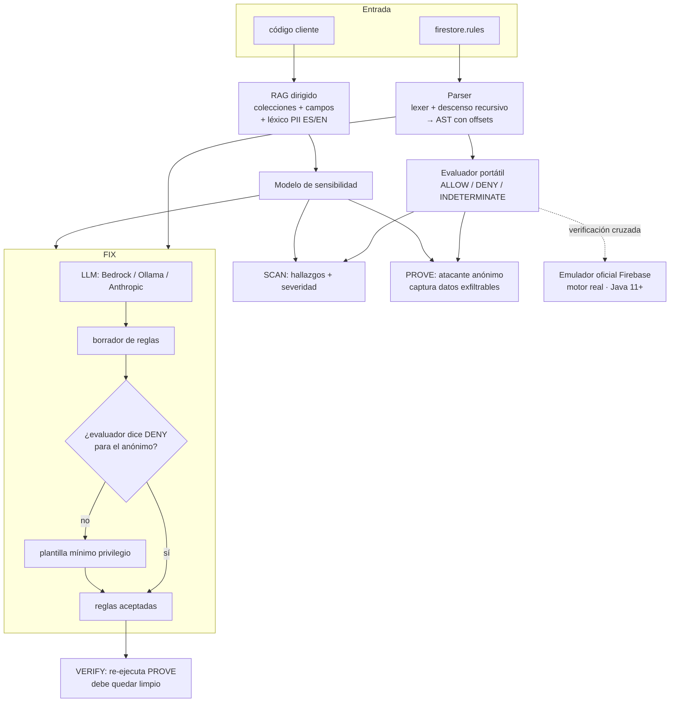

# Arquitectura de FUGA

## Visión general

FUGA es un agente especializado cuyo motor principal de IA se combina con un
**oráculo determinista** (un evaluador de reglas propio) para lograr algo que un
LLM solo no puede: **demostrar** y **verificar**. El LLM aporta lenguaje y
propuestas; el oráculo aporta la verdad.

## El oráculo: por qué un evaluador propio

Firestore evalúa reglas con un lenguaje tipo CEL. Depender del emulador oficial
como único oráculo obliga a instalar Java y arrancar un servidor por cada
comprobación — inviable en el navegador y lento en CI.

FUGA implementa un **evaluador del subconjunto real de CEL** que aparece en
producción:

- Literales, comparaciones, lógica booleana con cortocircuito.
- `request.auth`, `request.auth.uid`, `request.auth.token.*`.
- `resource.data.*`, `request.resource.data.*`.
- Variables de path (`{uid}`) y comodín recursivo (`{document=**}`).
- Funciones auxiliares definidas en las reglas; `get()`/`exists()` contra datos
  sembrados.

Diseño **conservador**: cualquier construcción no soportada evalúa a
`INDETERMINATE`, nunca a un `ALLOW` falso. Así, cuando FUGA dice "fuga probada",
lo es. El emulador oficial queda como red de seguridad de máxima fidelidad
(`fuga emulator`).

## RAG: contexto de dominio

En lugar de embeddings pesados, FUGA hace *retrieval* dirigido: extrae de tu
código las llamadas a Firestore (`collection`, `doc`, `where`, `setDoc`, …) para
reconstruir el esquema. Un léxico bilingüe (ES/EN) de colecciones y campos
sensibles convierte ese esquema en un **juicio de sensibilidad**: una fuga en
`/pagos` con `numeroTarjeta` es crítica; una en `/logs` es ruido. Los campos que
el léxico no reconoce pueden clasificarse con un **modelo local** (Ollama), sin
que el esquema salga de la máquina.

## LLM: proponer, no gobernar

En seguridad no se puede aceptar que un LLM alucine reglas. FUGA invierte la
relación habitual: el LLM **propone** un borrador y el **evaluador lo valida**
re-ejecutando el atacante. Si el borrador no elimina la fuga, se descarta y se usa
una plantilla determinista de mínimo privilegio. El resultado nunca es peor que la
plantilla segura, y puede ser mejor cuando hay un LLM disponible.

## Superficies

- **CLI** (`@fuga/cli`): `scan/prove/fix/verify/emulator/demo/mcp`.
- **MCP** (`@fuga/mcp`): tools `fuga_scan/fuga_prove/fuga_fix` para agentes.
- **Web** (`@fuga/web`): el loop completo en una API route de Next.js.

Las tres comparten exactamente el mismo `@fuga/core`.
