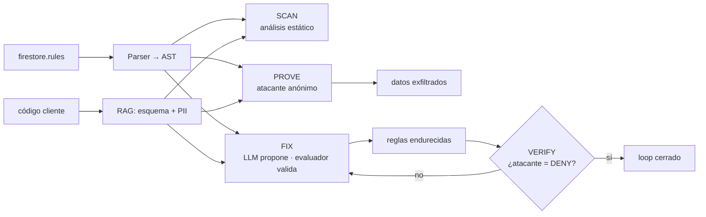

<div align="center">

# FUGA

**El agente que no advierte sobre fugas de datos: las demuestra, las repara y lo verifica.**

Reglas de Firestore mal configuradas (`allow read, write: if true`) → FUGA lanza un
atacante anónimo, te muestra los datos que se filtrarían, genera el fix de mínimo
privilegio y **re-verifica** que la fuga desapareció.

`scan` → `prove` → `fix` → `verify` · CLI · Web · MCP · RAG · Amazon Bedrock

**▶ Demo en línea: https://fuga-two.vercel.app**  ·  **Repo: https://github.com/JuanMCanchala/fuga**

</div>

---

## El problema

Dejar una base de datos Firebase abierta al mundo es una de las causas más comunes
de exposición de datos personales. El antipatrón es una sola línea:

```
match /{document=**} { allow read, write: if true; }
```

Con eso, **cualquier persona en Internet** puede leer y escribir toda tu base de
datos: tarjetas, cédulas, mensajes privados. Los linters existentes solo dicen
"esto parece inseguro" — y el desarrollador lo ignora porque no ve el impacto.

## El diferenciador: fuga entre usuarios (IDOR)

Todos los escáneres detectan lo obvio: "la regla es pública" o "el RLS está
apagado". El bug **difícil** —el que expuso apps de Supabase en masa
([CVE-2025-48757](https://nvd.nist.gov/)) y que ningún linter ve— es otro: la
regla **sí** exige estar autenticado, pero no comprueba que seas el **dueño**
del dato.

```
match /perfiles/{userId} { allow read, write: if request.auth != null; }
```

Un atacante anónimo obtiene DENY, así que el análisis clásico dice "seguro".
FUGA no ataca como anónimo: ataca como **un segundo usuario legítimo**. Crea a
"Mallory" (una cuenta cualquiera) y demuestra que puede leer y modificar el
registro de "Alice". La regla estaba autenticada pero no acotada al dueño:
**fuga entre usuarios, probada** — con la evidencia. Luego genera el fix por
dueño y **re-lanza el ataque** para confirmar que Mallory ya no entra.

Ningún competidor prueba esto: requiere ejecutar el ataque con dos identidades,
no coincidencia de patrones.

## La diferencia de FUGA

FUGA **ejecuta el ataque**. No opina: prueba.

```
1) SCAN    riesgo ████████████████████ 100/100
     CRÍTICO FUGA002 Escritura pública sin restricciones
     CRÍTICO FUGA004 Comodín recursivo con acceso global
     ALTO    FUGA003 Lectura pública sin restricciones

2) PROVE   4 fugas, 2 documentos exfiltrables
     {"ownerId":"alice","monto":1250000,"numeroTarjeta":"4111 1111 1111 1111","cvv":"321"}
     {"nombre":"Alice Pérez","email":"alice@correo.com","telefono":"+57 300 123 4567"}

3) FIX     reglas endurecidas (mínimo privilegio) + tests de regresión

4) VERIFY  ✔ el mismo atacante ahora queda DENEGADO. Fuga eliminada y verificada.
```

## Cómo funciona



**Cuatro piezas que se combinan de forma no trivial:**

| Pieza | Qué aporta |
|-------|------------|
| **Evaluador de reglas propio (TS)** | Oráculo portátil: decide ALLOW/DENY sin Java ni emulador. Corre en CI y en el navegador. |
| **RAG sobre tu código** | Infiere qué colecciones y campos existen. Distingue una fuga en `/logs` de una en `/pagos`. |
| **LLM propone, evaluador dispone** | El LLM sugiere reglas; se aceptan solo si el atacante queda en DENY. Nada de reglas alucinadas. |
| **Emulador oficial (opcional)** | Verificación cruzada con el motor real de Google (Java 11+). |

## Inicio rápido

```bash
git clone https://github.com/JuanMCanchala/fuga
cd fuga && npm install && npm run build

# Demo instantáneo (sin configurar nada)
node packages/cli/dist/index.js demo

# Sobre tu propio proyecto Firebase
node packages/cli/dist/index.js scan   --code ./src
node packages/cli/dist/index.js prove
node packages/cli/dist/index.js fix
node packages/cli/dist/index.js verify --rules firestore.rules.fuga
```

> Tras clonar y `npm run build`, el binario vive en `packages/cli/dist/index.js`.
> Publicación en npm (`npx fuga`) planificada — ver `.kiro/specs/fuga-agent/tasks.md`.

## Demo en línea

**→ https://fuga-two.vercel.app** — pega tus reglas de Firestore y mira la fuga
probada + el fix, en vivo. (Corre el loop completo con el motor portátil; sin
Java ni claves.)

```bash
npm run web   # local en http://localhost:3939
```

Detalles de despliegue en [DEPLOY.md](./DEPLOY.md).

## Como servidor MCP (Kiro / Claude / Cursor)

FUGA se expone como MCP para que un agente lo use a media conversación:

```jsonc
// .kiro/settings/mcp.json  (o la config MCP de tu cliente)
{
  "mcpServers": {
    "fuga": { "command": "node", "args": ["./packages/mcp/dist/bin.js"] }
  }
}
```

Tools: `fuga_scan`, `fuga_prove`, `fuga_fix`. Ejemplo de uso por un agente:
*"revisa la seguridad de estas reglas"* → llama `fuga_prove`, ve las fugas reales,
llama `fuga_fix`, re-verifica.

## Motores de IA (local + nube)

Configurable con `FUGA_LLM`:

| Valor | Motor | Uso |
|-------|-------|-----|
| `kiro` | **Kiro CLI** (headless) | Reescribe las reglas usando tus créditos de Kiro (local) |
| `bedrock` | **Amazon Bedrock** (AWS) | Reescritura de reglas en la nube |
| `ollama` | Modelo **local** | Clasificación de PII sin enviar tu esquema a la nube |
| `anthropic` | Claude API | Alternativa en la nube |
| `openai` | GPT (`gpt-4o-mini` por defecto) | Reescritura de reglas vía OpenAI |
| `none` | Sin LLM | Plantilla determinista (funciona siempre) |

FUGA funciona **sin ningún LLM ni clave**: el fix determinista y el oráculo
portátil garantizan resultados reproducibles. El LLM solo mejora la redacción del
fix, y siempre se valida con el evaluador.

Guía de Amazon Bedrock (habilitar modelos, inference profiles, IAM de mínimo
privilegio): **[aws/README.md](./aws/README.md)**.

## Estructura

Monorepo (`packages/core`, `packages/cli`, `packages/mcp`, `apps/web`). Ver
[`.kiro/steering/structure.md`](./.kiro/steering/structure.md) y la arquitectura
en [`ARCHITECTURE.md`](./ARCHITECTURE.md).

## Construido con Kiro

Este proyecto se desarrolló con el flujo spec-driven de Kiro. Los specs viven en
[`.kiro/specs/fuga-agent/`](./.kiro/specs/fuga-agent/) (requirements → design →
tasks) y el steering en [`.kiro/steering/`](./.kiro/steering/).

## Pruebas

```bash
npm test   # 23 pruebas de node:test sobre el core
```

## Reto

Hackatón Código Facilito × Kiro — **Reto 3: Agentes especializados**.

## Licencia

MIT © Juan Manuel Canchala
